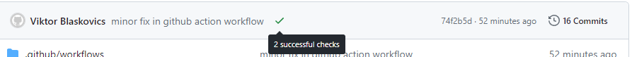
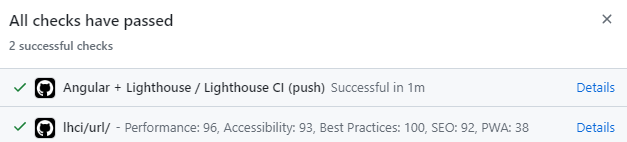

# Angular Lighthouse CI Analízis

A projekt tartalma egy Angular SSR alkalmazás és egy hozzá tartozó Github Action workflow, ami lefuttat egy Lighthouse analízist minden master commit után. A mérési eredmények megtekinthetők a commit üzenet melleti státusz check alatt:

Jelen beállítás mellett a lighthouse analízis minden master commit után lefut, 3 mérést végezve az alábbi metrikákra:

- performance
- accessibility
- best-practices
- seo

Ha a mért értékek egy adott szint alá esnek, a pipeline elhasal.

## GitHub Actions konfiguráció

A GitHub Actions konfigurációja a `.github/workflows/lighthouse.yml` fájlban található.

## Lighthouse konfiguráció

A Lighthouse konfiguráció a `lighthouserc.json` fájlban található.

## Scripts

- serve:ssr: ssr szerver indítása
- lhci: lighthouse analízis lokálisan
